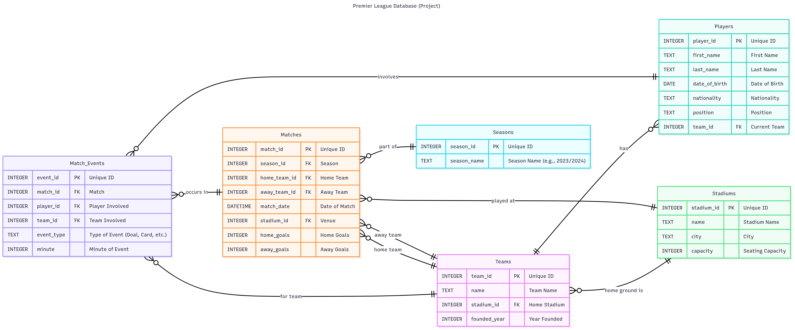

# Design Document of Premier League Database
**By Anish Kar**

Video overview: [youtube video](https://youtu.be/yhBDMzLehGg)

## Scope
### Purpose
The purpose of this database is to create a structured and queryable repository of statistical data for the English Premier League. It models core components of the league, enabling users to store, retrieve, and analyze information about teams, players, match results, and key in-game events across multiple seasons.

### In Scope
- **Things**: Seasons, Matches, Match Events (Goals, Cards, Injuries).
- **People**: Players.
- **Places**: Stadiums.
- **Organizations**: Teams.
- **Time Period**: Premier League seasons 2022/2023, 2023/2024, and 2024/2025 (including promoted/relegated teams).

### Out of Scope
- Financial Data (salaries, transfers, revenues).
- Substitute and Reserve Players (anyone apart from the main XI)
- Non-Player Staff (managers, coaches).
- Detailed Player History (transfers, loans).
- Advanced Metrics (assists, pass completion rates).

---

## Functional Requirements
### User Capabilities
Users should be able to:
- **Create**: Insert players, teams, stadiums, seasons, matches, and events.
- **Read**: Query top scorers, team matches, player/stadium details, or high-scoring matches.
- **Update**: Modify match scores, transfer players (update `team_id`), or edit team/player data.
- **Delete**: Remove incorrect events or retired players (with integrity checks).

### Beyond Scope
- Managing payrolls/contracts.
- Tracking cross-club player history.
- Analyzing non-Premier League tournaments.
- Generating financial reports or stadium logistics.

---

## Representation
### Entities & Attributes
**Seasons**  : `season_id` (INT PK), `season_name` (TEXT UNIQUE)
**Stadiums** : `stadium_id` (INT PK), `name` (TEXT UNIQUE), `city` (TEXT), `capacity` (INT)
**Teams**    : `team_id` (INT PK), `name` (TEXT UNIQUE), `stadium_id` (INT FK), `founded_year` (INT)
**Players**  : `player_id` (INT PK), `first_name` (TEXT), `last_name` (TEXT), `date_of_birth` (DATE), `nationality` (TEXT), `position` (TEXT), `team_id` (INT FK)
**Matches**  : `match_id` (INT PK), `season_id` (INT FK), `home_team_id`/`away_team_id` (INT FK), `match_date` (DATE), `stadium_id` (INT FK), `home_goals`/`away_goals` (INT DEFAULT 0)
**Match_Events** : `event_id` (INT PK), `match_id` (INT FK), `player_id` (INT FK), `team_id` (INT FK), `event_type` (TEXT), `minute` (INT)

### Design Choices
- **Data Types**:
  - `INTEGER` for IDs and numerical data (efficient joins/indexing).
  - `TEXT` for descriptive fields (names, cities).
  - `DATE` for temporal sorting.
  - `AUTOINCREMENT` for PKs to ensure uniqueness.
- **Constraints**:
  - `PRIMARY KEY`/`FOREIGN KEY` for integrity.
  - `NOT NULL` for critical fields.
  - `UNIQUE` on names to prevent duplicates.
  - `DEFAULT 0` for match goals (unscheduled matches).

---

## Relationships

- **Seasons → Matches**: One-to-many (one season has many matches).
- **Stadiums → Teams**: One-to-many (one stadium hosts one team).
- **Teams → Players**: One-to-many (one team has many players).
- **Teams → Matches**: Many-to-many (via `home_team_id`/`away_team_id`).
- **Matches → Match_Events**: One-to-many (one match has many events).

---

## Optimizations
### Indexes
- Created on all foreign keys and frequently queried columns (e.g., `Matches.match_date`).
- **Why?** Speeds up `JOIN` and `WHERE` operations by avoiding full table scans.

### Views
1. **`V_MatchResults`**: Simplified match summaries (avoids complex joins).
2. **`V_TopScorers`**: Pre-calculates player goal totals.
3. **`V_StadiumDetails`**: Lists stadiums with home teams.

---

## Limitations
### Design Limitations
- **No Player History**: Transfers overwrite `team_id` (no record of past teams).
- **No Manager Tracking**: Cannot associate managers with specific matches.
- **Limited Events**: Cannot model substitutions, assists, or nuanced stats.

### Poor Representation
- **Loan Spells**: No temporary team assignments.
- **Advanced Stats**: Cannot answer questions like "top passer" or "distance covered".
